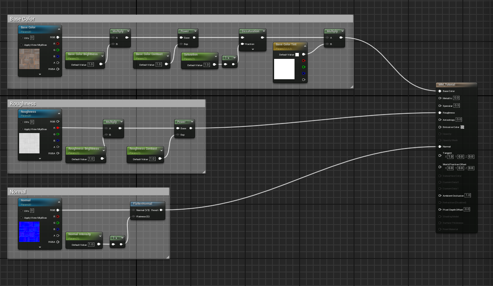
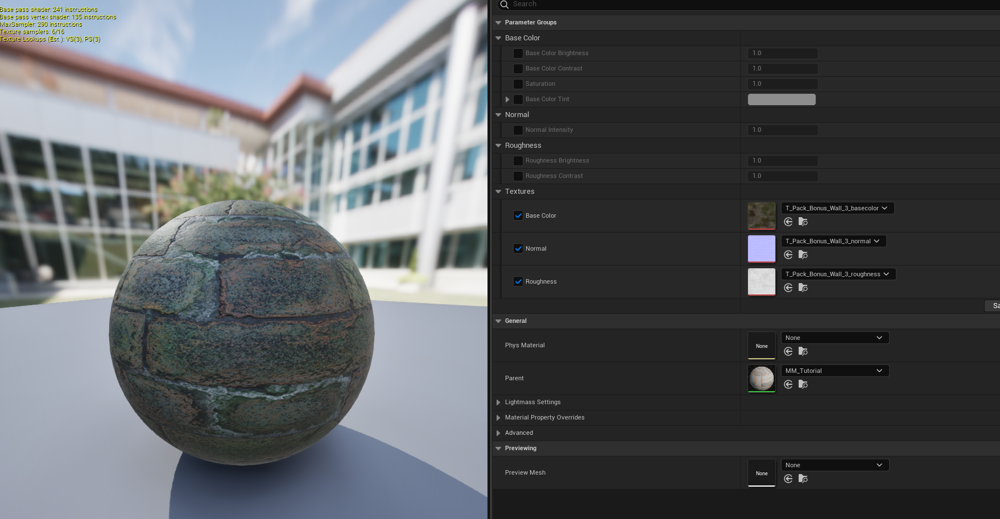

# Unreal Engine Base Material
## Overview
This project demonstrates a resuable Base Material designed to support a wide range of surface looks through material instances.

The material is intended to reflect real-world production workflows, where artists iterate through exposed parameters.
## Goals
- Create a scalable, artist-friendly base material
- Reduce material duplication through parameterization
- Support rapid iteration through material instances
## Features
### Surface Inputs
- Base Color
- Normal Map
- Roughness
### Color Controls
- Brightness
- Contrast
- Saturation
- Tint
### Position Controls
- Texture Tiling
- Texture Offset
- Rotation
## Examples
> 
> 
